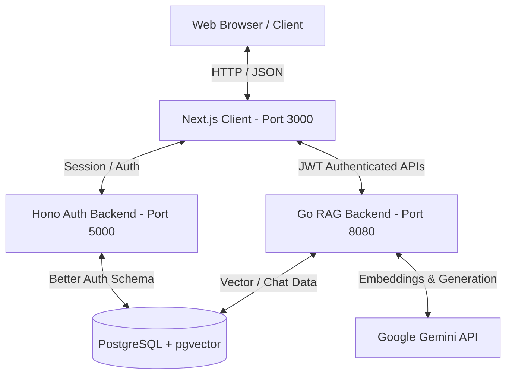

# Mandatory Backend System Design Document (Certified Version)

This document defines the architecture, standard protocols, security constraints, and data flows for the backend services of the **SWD392 Chatbot RAG** project.

---

## 1. System Architecture Overview

The system is designed as a decoupled, microservices-adjacent monorepo consisting of:
1. **Frontend (Next.js)** on Port `3000`: Client-side UI using Mantine v7. Does not query the DB directly; all auth/data queries flow through API requests.
2. **Auth Backend (Node/Hono)** on Port `5000`: Handles Better Auth registration, login, and sessions. Connects directly to the PostgreSQL database.
3. **RAG Backend (Go/Golang)** on Port `8080`: Orchestrates document parsing, text chunking, embedding generation via Gemini API, pgvector storage, and context retrieval for AI generation.



---

## 2. Go Backend Clean Architecture

The Go backend (located in `backend/go`) strictly implements **Clean Architecture** rules to decouple business logic from external frameworks, databases, and APIs.

### 2.1 Layer Breakdown

```
Go Backend (backend/go/internal)
 ├── domain/                   # Enterprise Business Rules (Entities & Interfaces)
 │    ├── user/
 │    ├── document/
 │    └── chat/
 ├── application/              # Application Business Rules (Use Cases)
 │    ├── auth-usecase/
 │    ├── document-usecase/
 │    └── chat-usecase/
 ├── infrastructure/           # Interface Adapters - External (Implementations)
 │    ├── repository/postgres/ # DB repository implementations
 │    ├── embedding/           # Gemini API Client
 │    └── fileparser/          # PDF, DOCX, PPTX parsers
 └── interface/                # Interface Adapters - Internal (HTTP/Handlers)
      ├── handler/             # API controller endpoints
      ├── middleware/          # JWT Verification & CORS
      └── router.go            # Endpoint mappings
```

### 2.2 Dependency Direction & Integrity Rules

To preserve architectural boundaries, the backend enforces the following constraints:
1. **The Dependency Rule**: Source code dependencies must only point inwards. Elements in the outer circles (Infrastructure, Interface) cannot affect or import inner circles (Application, Domain).
2. **Interface Inversion**: The Domain layer defines repository interfaces (e.g., `DocumentRepository`). The Infrastructure layer implements these interfaces using pgx/database drivers. Use cases only interact with Domain interfaces, never concrete database implementations.
3. **No DB Access in Handlers**: Handlers must only receive requests, map them to DTOs, invoke the corresponding Use Case in the Application layer, and return response payloads. Direct SQL execution or pgx queries inside handlers is strictly forbidden.

---

## 3. RAG Pipeline & Vector Search Engine

The core value of the platform is retrieving relevant context from uploaded textbooks to answer user questions using Google Gemini LLM.

### 3.1 Document Ingestion & Chunking
* **File Processing**: When a document (PDF, DOCX, PPTX, TXT, MD) is uploaded, it is saved in a structured disk layout (`uploads/{course_id}/{uuid}.ext`).
* **Background Worker**: Ingestion runs asynchronously via a background task queue to avoid blocking HTTP threads.
* **Chunking Strategy**: Extracted text is split into chunks of approximately **500 tokens** with a **10% overlap** to preserve semantic continuity across chunk boundaries.

### 3.2 Vectorization & Storage
* **Embeddings Model**: Uses **Gemini Embedding 2** (`text-embedding-004`) to convert text chunks into **768-dimensional float arrays**.
* **Database Extension**: PostgreSQL runs the `pgvector` extension. The `chunks` table stores the vector in an `embedding vector(768)` column.
* **Index Method**: Utilizes an **HNSW (Hierarchical Navigable Small World)** index with cosine distance operators (`vector_cosine_ops`) to guarantee sub-millisecond similarity retrieval at scale.

```sql
-- HNSW Vector Index Definition
CREATE INDEX ON chunks USING hnsw (embedding vector_cosine_ops);
```

### 3.3 Semantic Retrieval & Generation Loop
1. **Query Embedding**: The user's prompt is vectorized using the Gemini Embedding API.
2. **Cosine Similarity Search**: Performs a nearest-neighbor query using the `<=>` cosine distance operator:
   ```sql
   SELECT id, content, page_label, 1 - (embedding <=> $1) AS similarity
   FROM chunks
   WHERE course_id = $2
   ORDER BY embedding <=> $1
   LIMIT 5;
   ```
3. **Guardrail / Relevance Threshold**:
   * If the maximum similarity score of the top-retrieved chunk is `< 0.60`, the question is marked as **Out of Scope**.
   * The RAG backend bypasses Gemini LLM context feeding and responds with a standardized fallback message: *"Không tìm thấy thông tin phù hợp trong tài liệu của môn học này."*
4. **Prompt Assembly**: If valid context is found, a prompt is built containing:
   * **System Persona**: Guidelines enforcing strict grounding (do not make up facts outside the context).
   * **Context Block**: Top-5 retrieved text chunks with source metadata.
   * **Chat History**: Up to 10 previous messages to keep conversation context.
   * **User Prompt**: The current question.
5. **Gemini LLM Call**: The assembled prompt is sent to `gemini-1.5-flash` or `gemini-2.0`.
6. **Citations Mapping**: The returned response is saved alongside references to the original `Chunk` IDs, which are sent back as a citation array (`{chunk_id, file_name, page_label, excerpt}`) to display in the Mantine client.

---

## 4. Authentication Handshake & JWT Verification

Better Auth serves as the master authentication provider. Since it resides in the Hono service on port 5000, a secure cross-service JWT verification handshake is used for the Go backend.

```
Next.js Client (Port 3000)          Hono Auth Service (Port 5000)       Go Backend (Port 8080)
           │                                      │                                │
           ├────── Register/Login credentials ───►│                                │
           │                                      │                                │
           │◄───── Set Cookie / Send JWT token ───┤                                │
           │                                                                       │
           ├───────────────────── API Request + Bearer JWT ───────────────────────►│
           │                                                                       │  [AuthMiddleware]
           │                                                                       │  ├── Read Bearer Token
           │                                                                       │  ├── Parse using JWT Secret
           │                                                                       │  └── Verify active expiration
           │                                                                       │
           │◄──────────────────── Return Protected JSON data ──────────────────────┤
```

### 4.1 Security Constraints & Shared Secret
* **Secret Key**: Both Hono and Go backends read the same environment variable `BETTER_AUTH_SECRET`.
* **Validation Method**: The Go backend utilizes `jwt-go` inside its authentication middleware (`backend/go/internal/interface/middleware/auth.go`).
* **Subject Claim**: The `sub` claim inside the validated JWT contains the user's UUID, which the Go backend extracts and injects into the request context (e.g. `ctx.Set("user_id", userId)`) for subsequent handlers.

---

## 5. Database Schema & Tables Summary

The database uses PostgreSQL with the schema detailed in `docs/ERD.txt`. Below is the logical summary of RAG-related tables:

| Table Name | Description | Key Fields / Data Types |
|------------|-------------|-------------------------|
| `users` | Accounts registered via Better Auth. | `id` (UUID), `email` (TEXT), `name` (TEXT) |
| `courses` | Course workspaces (e.g. SWD392). | `id` (UUID), `name` (TEXT) |
| `chapters` | Chapter sub-groupings within a course. | `id` (UUID), `course_id` (UUID), `title` (TEXT) |
| `documents`| Uploaded source textbooks or documents. | `id` (UUID), `file_name` (TEXT), `status` (TEXT) |
| `chunks` | Extracted text pieces with embeddings. | `id` (UUID), `content` (TEXT), `embedding` (vector(768)) |
| `chat_sessions`| User chat threads. | `id` (UUID), `user_id` (UUID), `course_id` (UUID) |
| `messages` | Chat history messages (User / Bot). | `id` (UUID), `session_id` (UUID), `role` (TEXT), `content` (TEXT) |
| `message_citations`| Citations binding bot messages to chunks. | `id` (UUID), `message_id` (UUID), `chunk_id` (UUID) |
