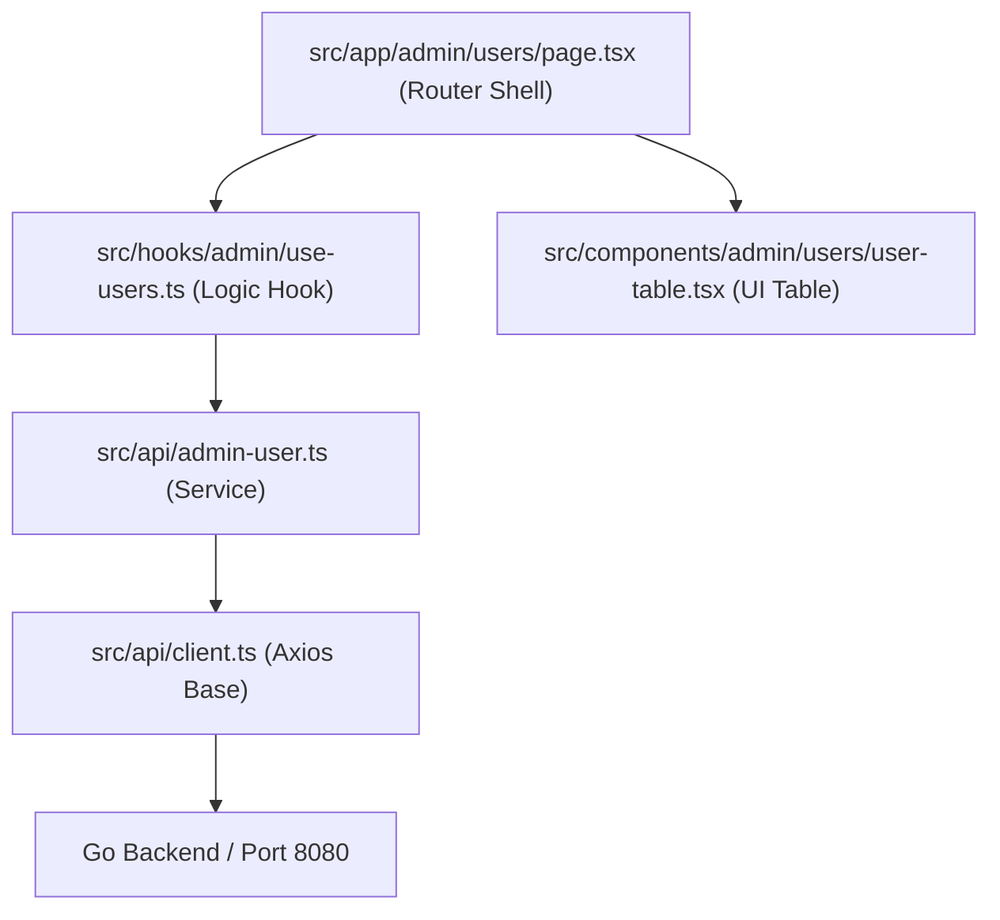

# StudyMate RAG Chatbot - Frontend Design System

This document defines the visual guidelines, typography, colors, layout rules, and interaction patterns for the StudyMate Frontend. All UI code must conform strictly to these design tokens and Mantine v7+ configurations.

---

## 1. Visual Direction & Style Match
*   **Design Personality:** **AI-Native + Academic Scholarly**. Focuses on highly readable educational content, ambient gradients, card layouts, and responsive panels.
*   **Aesthetic Principle:** Clean white surface panels on a minimalist light gray/white background, accented by cleaner blue/cyan branding.

---

## 2. Design Tokens

### 2.1. Color Palette (HSL & Hex Mapping)
We prioritize high-contrast, professional shades suited for long academic reading sessions.

| Role | Variable | Hex Code | Purpose |
|:---|:---|:---|:---|
| **Primary** | `var(--mantine-color-blue-filled)` | `#0EA5E9` (Sky-500) | Primary buttons, active tabs, brand headers |
| **Secondary** | `var(--mantine-color-blue-light)` | `#E0F2FE` (Sky-100) | Accent badges, borders, hover states |
| **CTA / Highlight**| -- | `#06B6D4` (Cyan-500) | Special triggers (e.g., Take Quiz, RAG citation) |
| **Background** | `var(--mantine-color-body)` | `#FFFFFF` (White) | App workspace background |
| **Card Surface** | -- | `#FFFFFF` | Form fields, data cards, chat box, tables |
| **Text Primary** | `var(--mantine-color-text)` | `#0F172A` (Slate-900) | Title, body text, readable content |
| **Text Muted** | `var(--mantine-color-dimmed)` | `#475569` (Slate-600) | Secondary descriptions, file metadata |

### 2.2. Typography (Google Fonts Integration)
*   **Headings & Body UI Text:** `Plus Jakarta Sans` (A modern, clean, geometric sans-serif font for maximum legibility and UI visual quality).
*   **Secondary/Research Text:** `Newsreader` (A premium serif font for academic/research papers, used via the `.font-serif` utility class).
*   **Monospace/Code:** `JetBrains Mono` (For JSON data views, configurations, and logs).
*   **Line-Height:** 1.6 - 1.75 for reading lists, 1.5 for UI buttons and menus.

### 2.3. Borders & Shadows
*   **Border Radius:** 
    *   `md` (8px) for buttons, small input fields.
    *   `lg` (12px) for table container paper and small cards.
    *   `2xl` (16px) for modals, main sidebar panels, and input fields.
*   **Shadows:** Soft ambient shadows (`--shadow-soft` in globals.css) to raise surface cards off the violet background.

---

## 3. Component Guidelines (Mantine v7+)

### 3.1. Tables (Mantine `Table`)
*   All data list views (Users, Curriculum, Documents) must use Mantine `Table`.
*   Striped and highlight-on-hover properties should be active.
*   Tables must be wrapped inside a `Table.ScrollContainer` to ensure responsiveness on mobile devices.

### 3.2. Forms & Inputs (Mantine `TextInput`, `PasswordInput`, `Select`)
*   Forms must use `@mantine/form` or `react-hook-form` validation.
*   Required inputs must display the asterisks (`withAsterisk`).
*   Disable submit buttons and show a loading spinner (e.g., Mantine `Loader`) during async submissions.

### 3.3. Dialogs & Modals (Mantine `Modal`)
*   All dialog operations (creating user, editing subject, document upload) must use Mantine `<Modal centered>`.
*   A backdrop blur (`backgroundOpacity={0.4} blur={4}`) must be applied to focus visual attention on the modal contents.

### 3.4. Icons (Tabler Icons or Lucide React)
*   **Strict rule:** Do NOT use raw emoji characters as icons (e.g., 🎨, 🚀, ⚙️).
*   Use `@tabler/icons-react` consistently (e.g. `IconSearch`, `IconLock`, `IconPlus`).
*   Icon sizes: Standard size is `16` or `18` pixels (`size={18}`).

---

## 4. RAG Chat Interface UX Spec

To deliver a premium conversational interface:
1.  **Typing Indicator:** When Gemini is generating an answer, display a animated 3-dot pulse loading state.
2.  **Streaming Text Reveal:** Render responses dynamically. Respect `prefers-reduced-motion` settings.
3.  **Citations & Sources:** 
    *   Citations must be clickable badge chips (e.g., `[1]`, `[2]`).
    *   Clicking a citation must slide in a drawer or open a modal containing the exact text chunk extracted from the document source.
4.  **Auto Scroll:** The chat container must automatically scroll to the bottom when new message tokens arrive, but allow the user to pause auto-scroll if they scroll up manually.

---

## 5. UI/UX Pre-Delivery Checklist
All UI code changes must be verified against this checklist before code review:
- [ ] No emojis are used as system icons.
- [ ] Every clickable card/button has `cursor-pointer`.
- [ ] Active transitions take between `150ms` and `300ms`.
- [ ] Font size for body text is at least `16px` on mobile layouts.
- [ ] Light-mode text contrast is a minimum of 4.5:1 (Slate-600 to Slate-900).
- [ ] Element boundaries are responsive down to 375px without horizontal browser scroll.
- [ ] Focus rings are visible for users navigating using keyboard Tab.

---

## 6. Frontend Architectural Guidelines

This section describes the mandatory architecture for frontend files, folders, and code splitting. Any code that violates these patterns will be rejected in code reviews.

### 6.1. Folder Structure Tree

```text
src/
├── app/                                # 1. ROUTING LAYER (Only page.tsx, layout.tsx, providers)
│   ├── layout.tsx                      # Root Layout
│   ├── page.tsx                        # Root Page Redirect
│   ├── providers.tsx                   # Mantine & Query Provider Shell
│   ├── globals.css                     # Global CSS & Tailwind imports
│   ├── (auth)/                         # Auth Routes
│   │   ├── login/page.tsx              # Renders LoginForm
│   │   └── register/page.tsx           # Renders RegisterForm
│   └── [role]/                         # Role-Based Routing (admin, lecturer, student)
│       ├── layout.tsx                  # Role Layout (Dynamic Sidebar & Header)
│       ├── page.tsx                    # Role Dashboard Page
│       ├── chat/page.tsx               # Chat Interface Shell
│       ├── documents/page.tsx          # Documents Page Shell
│       └── users/page.tsx              # Users Page Shell
│
├── api/                                # 2. API LAYER (Axios Clients & Domain Services)
│   ├── client.ts                       # Base HTTP Clients (ragApi, authApi)
│   ├── auth.ts                         # Authentication endpoints
│   ├── admin-user.ts                   # Admin User endpoints
│   ├── chat.ts                         # RAG Chat & Session endpoints
│   ├── document.ts                     # Upload & Document Management endpoints
│   └── curriculum.ts                   # Term & Subject endpoints
│
├── components/                         # 3. PRESENTATION LAYER (Pure UI Components)
│   ├── layout/                         # Core Shell: header.tsx, sidebar.tsx, user-avatar.tsx
│   ├── common/                         # Multi-role UI: auth/, chat/ (chat-window, chat-input), settings/
│   ├── admin/                          # Admin UI: users/ (table, modals), curriculum/, assignment/
│   ├── lecturer/                       # Lecturer UI: documents/ (upload-dropzone, table), practice/
│   └── student/                        # Student UI: documents/, practice/, quiz/
│
├── hooks/                              # 4. LOGIC LAYER (Reusable logic & State hooks)
│   ├── use-auth.ts                     # Global session state hook
│   ├── admin/                          # Admin hooks (use-users.ts, use-curriculum.ts)
│   ├── lecturer/                       # Lecturer hooks (use-lecturer-docs.ts)
│   └── student/                        # Student hooks (use-student-docs.ts)
│
├── lib/                                # 5. LIBS CONFIG
│   ├── auth-client.ts                  # Better Auth Web SDK client
│   └── utils.ts                        # Styling / formatting helpers
│
└── types/                              # 6. TS TYPE DEFINITIONS
    ├── chat.ts
    ├── document.ts
    └── user.ts
```

### 6.2. Clean Route Pages (`src/app/`)
*   Files inside `src/app/` (other than standard layout configuration files like `providers.tsx`, `layout.tsx`) must ONLY act as router shells.
*   Do NOT write UI code, tables, forms, modals, or fetch logic inside `page.tsx`.
*   `page.tsx` files should simply import the matching component from `src/components/[role]/...` or `src/components/common/` and pass any routing parameters (like `params.id`) down as props.

### 6.2. Directory & Component Categorization (`src/components/`)
All component files must live in `src/components/` and be categorized into the following subfolders:
1.  `src/components/layout/`: Common layout elements (Sidebar, Header, dynamic menus).
2.  `src/components/common/`: Feature components shared by multiple user roles (e.g. `auth/login-form.tsx`, `chat/chat-window.tsx`).
3.  `src/components/admin/`: Components only accessible to the **Admin** role (e.g. `users/user-table.tsx`, `curriculum/subject-modal.tsx`).
4.  `src/components/lecturer/`: Components only accessible to the **Lecturer** role (e.g. `documents/upload-dropzone.tsx`).
5.  `src/components/student/`: Components only accessible to the **Student** role (e.g. `quiz/quiz-runner.tsx`).

### 6.3. API Layer Organization (`src/api/`)
*   **No raw `fetch()` calls in components:** Direct `fetch` calls are banned.
*   **Central client (`src/api/client.ts`):** Defines the base Axios instances for the RAG Go backend (`ragApi` on port 8080) and the Auth backend (`authApi` on port 5000), including automatic authorization headers.
*   **Domain Services:** Domain-specific API definitions must live in `src/api/` (e.g. `src/api/admin-user.ts`, `src/api/chat.ts`, `src/api/document.ts`).

### 6.4. Logic Separation & Code Splitting (Custom Hooks)
*   **Max 200 Lines Rule:** Any component file must be under 200 lines of code. If a file exceeds this limit, it must be split into sub-components or have its logic extracted.
*   **Custom Hooks:** Extract state management, form submissions, and API interactions into custom React Hooks inside `src/hooks/[role]/` (e.g., `src/hooks/admin/use-users.ts`). The component should only read state variables and call event handler functions passed from the hook.

### 6.5. Code Organization Diagram


